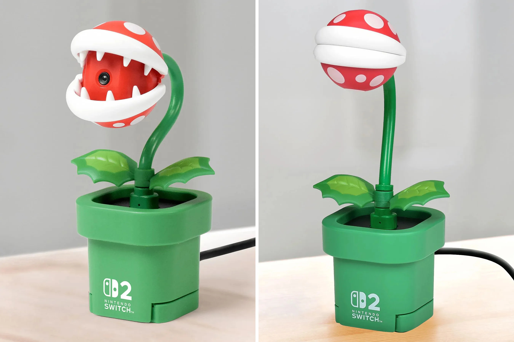

The Nintendo Switch 2’s new Piranha Plant Webcam is one of the coolest accessories I've seen in a long time. Just look at this little guy:

But even it has a good design, it has a really bad quality video sensor. It’s not even 1080p in 2025!. The resolution is 640*480, when I first tried I felt like taking pictures with my old 3ds. So I decided to open it up and see if I can replace the sensor with a better one. Hoping that I can adapt a new module to the existing PCB.

But before I start, I need to make a little disclaimer:

> **⚠️ Disclaimer:** Modding your device may void your warranty and carries a risk of damage. Proceed at your own risk.

Ok, let's get started!

## What You’ll Need

It is not very hard to open the webcam, but you need some tools. Here’s what I used:

- A precision screwdriver set (Phillips #00 and #000)
- A plastic spudger or pry tool (no metal — avoid scratching or cracking)

I bought a cheap set of screwdrivers from Amazon, and it worked fine. You can also use a guitar pick or a similar plastic tool if you don't have a spudger.

## Opening the Webcam

So I make a step-by-step guide to open the webcam safely in this post, but if If you're a visual learner, I’ve recorded a full video walkthrough showing each step of the teardown. 

### Step-by-Step Photo Guide